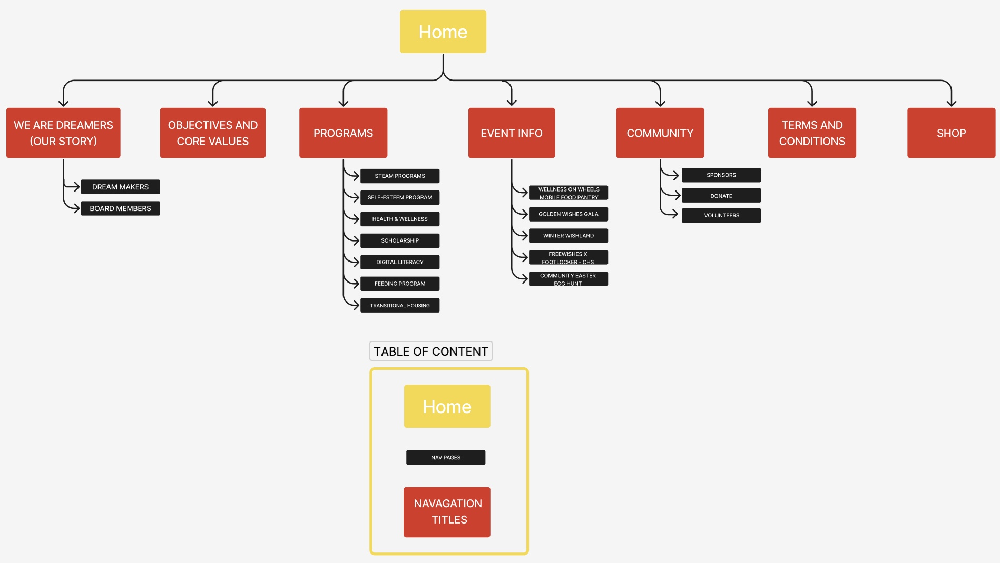

## CLient Site Profile

# Akashdeep Samra

# Who is the Client?

Client: Foundation for a good cause - Freewishes foundation

Industry: Non-profit organization

Audience: Beneficiaries or recipients of the organization's services, potential volunteers, and prospective donors.

Link:[https://freewishes.org/]
 "sitemap)

Foundations Purpose:
Freewishes Foundation mission is to provide educational support, health & wellness, and transitional services to the community to empower them to be self-sufficient and allow their dreams to come alive. The vision is to provide services globally that will impact change, inspire, motivate, and transform the community’s mindsets.

#Sitemap

Figma link: {https://www.figma.com/file/WAOzRjkcMNlrfus7TvEp1w/Sitemap---cpnt200-a1?node-id=0%3A1&t=j9fTqacYLu1v1VMi-1}

Additional Info: 
The nav elements provide a good categorisation for sub-elements, although they themselves are not web pages. They link to other pages in the sub-navigation menu however and add to the site structure, hence why they are included with their own colour code.
The search pages are considered to be single pages, that move to collections after the search is conducted.

