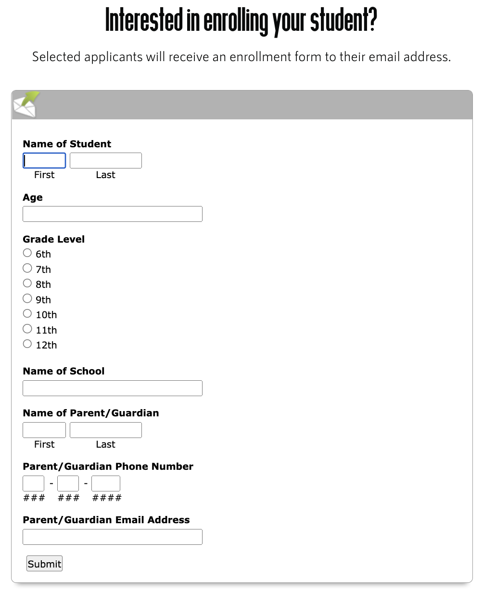

## Client Site Profile

# Akashdeep Samra

# Who is the Client?

Client: Foundation for a good cause - Freewishes foundation

Industry: Non-profit organization

Audience: Beneficiaries or recipients of the organization's services, potential volunteers, and prospective donors.

Link:[https://freewishes.org/]

Foundations Purpose:
Freewishes Foundation mission is to provide educational support, health & wellness, and transitional services to the community to empower them to be self-sufficient and allow their dreams to come alive. The vision is to provide services globally that will impact change, inspire, motivate, and transform the community’s mindsets.

#Sitemap
 

Figma link: {https://www.figma.com/file/WAOzRjkcMNlrfus7TvEp1w/Sitemap---cpnt200-a1?node-id=0%3A1&t=j9fTqacYLu1v1VMi-1}

#Homepage

Interface:
- Nav bars
- Hero image
- Title: Big text

#Collection: Community Easter Egg Hunt
Menu option

Interface:
- Image Gallery
- Big text heading 

#Contact

Interface:
- Radio Buttons
- Event Listener
- Small Text
- Form

Is the site well constructed?

The site is very informational. It has the nav bar easy to view and access at very top and lots of visual hierachy with the images on the site that 

How does this website relate to my Strapi Project?

I would like to create a bright website which is informative to the user while providing use and purpose.

What could be improved?

Alot of the menu tags could be shortened down although this does provide more information to the user it makes the site look overloaded with too many words since people have a shorter attention spam and do not like to read too much have shorter descriptions.

Also the site needs shorter videos.

